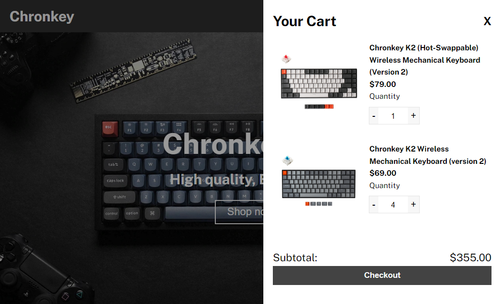

# shopping-cart

Shopping Cart project for The Odin Project. Made with React.

## Demo

[Live Preview](https://nevz9.github.io/shopping-cart)

## Screenshots

## Lessons Learned

I've learn ed about how I can utilize routes in order to navigate between different URLs to display different components to the web. There's also testing in react which actually took a lot of time to learn and all of it aren't sinking yet, hopefully I can improve my unit testings in the future. I'm happy with the outcome, i'll come back to it to refactor.

## Acknowledgements

- [The Odin Project](https://www.theodinproject.com/)
- [Inspiration](https://www.keychron.com/)
